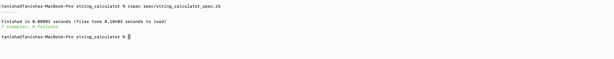
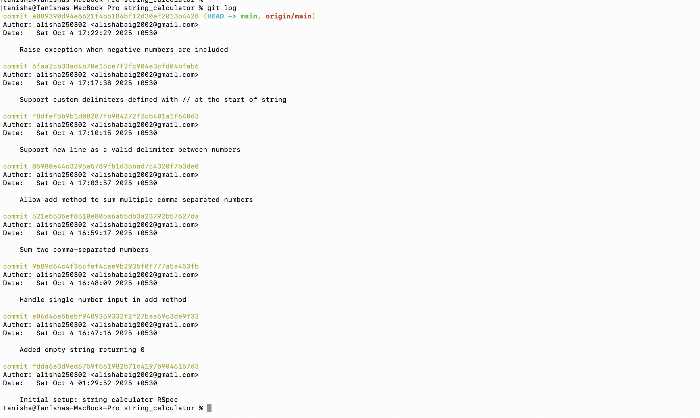
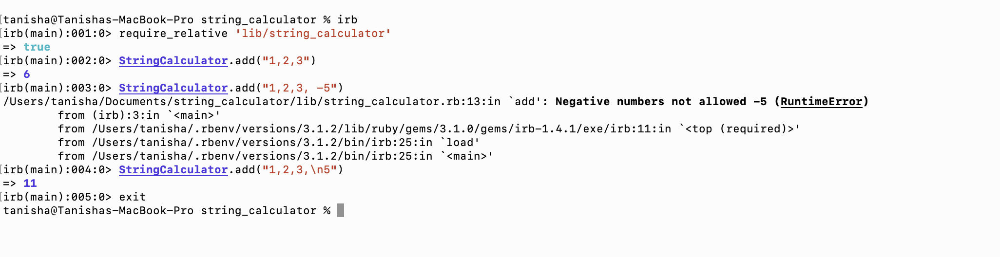

## Running the Tests (RSpec)

If you don’t have RSpec installed, install it first:

gem install rspec

Then, run the tests:
rspec spec/string_calculator_spec.rb

## Running in IRB
irb
Then inside IRB:
require_relative 'lib/string_calculator'

# Examples
StringCalculator.add("")        # => 0
StringCalculator.add("1,2,3")   # => 6
StringCalculator.add("//;\n1;2") # => 3

## Screenshots & Evidence

To make it easy to review my TDD workflow and code quality, I have included screenshots of key steps:

1. **All tests passing**  
   Screenshot of RSpec output showing all tests passing:
   

2. **Commit history**  
   Screenshot showing incremental commits for each TDD step:
   

3. **Code in action (optional)**  
   Screenshot of IRB running some example calculations:
   

---

### Notes

- The `docs/` folder contains these images.  
- Screenshots demonstrate **TDD evolution**, from empty string → single number → multiple numbers → delimiters → negative number handling → refactoring.  
- All commits have descriptive messages to highlight each step.
